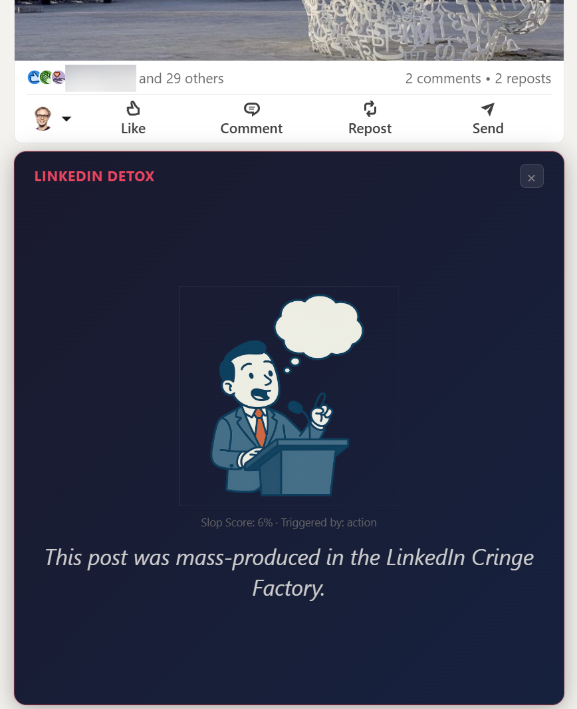
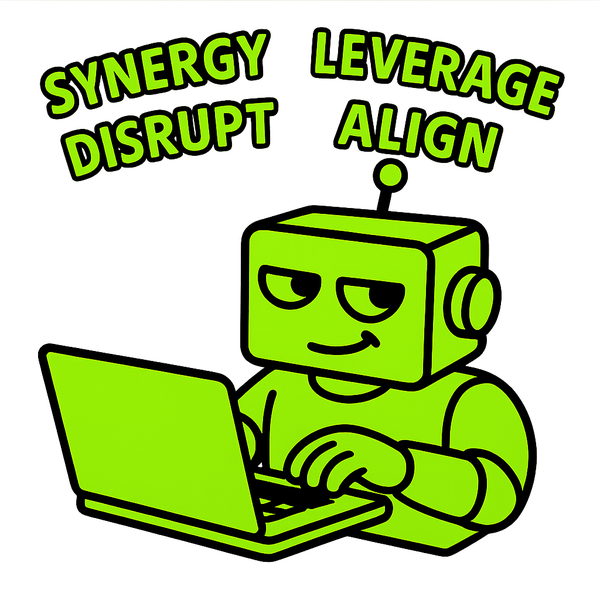
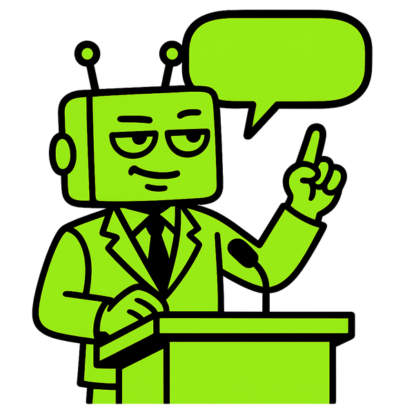
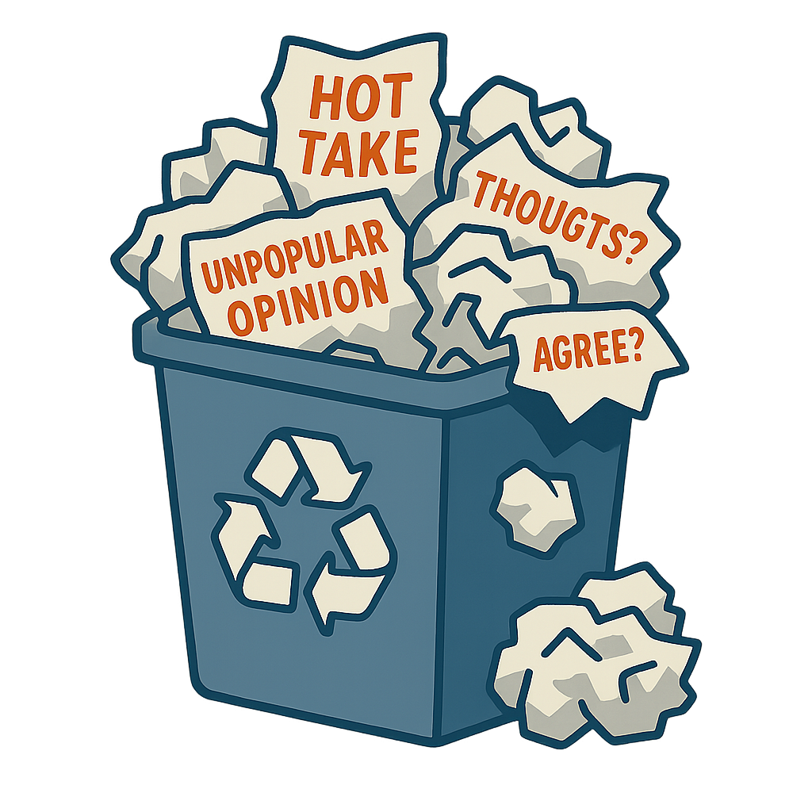

# LinkedIn Detox

**Your feed deserves better.**

A Chrome extension that detects AI-generated slop on LinkedIn and either hides it or drops a snarky roast banner right on top.



## What It Catches

LinkedIn Detox runs every post through a multi-layered detection pipeline:

- **Em dash & ellipsis abuse** -- because real humans -- don't write -- like this...
- **Buzzword density** -- leverage, synergy, unlock, align, disrupt, and the rest of the LinkedIn bingo card
- **Thought-leader templates** -- "I'm humbled to share..." / "Unpopular opinion, but..." (it's never unpopular)
- **AI semantic matching** (opt-in) -- a small embedding model that catches slightly rephrased slop

One strong signal is all it takes. Your feed gets cleaner, one post at a time.

## The Banners

When a post gets caught, it doesn't just disappear. It gets _roasted_.

Each flagged post is replaced with a randomly selected banner and message:

<p align="center">
  
  
  
  
</p>

Sample roasts include:

> _"This post was mass-produced in the LinkedIn Cringe Factory."_

> _"Somewhere, a ChatGPT prompt just shed a tear of pride."_

> _"Another day, another thought leader who let AI do the thinking."_

> _"The algorithm thought you'd love this. The algorithm was wrong."_

## Install

No app store, no build step, no npm install. Just Chrome.

1. Clone or download this repo
2. Open `chrome://extensions/`
3. Enable **Developer mode** (top right toggle)
4. Click **Load unpacked** and select the project folder
5. Navigate to [linkedin.com](https://www.linkedin.com) and watch the magic happen

## Settings

Click the extension icon to open the popup:

- **Roast / Hide** -- replace posts with banners, or just make them disappear
- **Sensitivity** -- Chill, Suspicious, or Unhinged (you know which one you want)
- **AI Detection** -- opt-in semantic scoring for catching rephrased slop (downloads ~5MB model on first use)
- **Custom Patterns** -- add your own signal words and co-occurrence patterns for that coworker who keeps posting AI-generated "insights"
- **Test Mode** -- debug overlay that shows scores and triggers on every post

## How It Works

The detection engine scores posts from 0-100 using independent scorers. The final score is `max(all_scores)` -- one strong signal is enough. Posts above your sensitivity threshold get blocked.

The extension watches LinkedIn's feed with a MutationObserver, hashes post text (because LinkedIn virtualizes its DOM and element refs don't persist), and overlays banners on flagged posts every render frame.

For the technically curious, the semantic scorer runs a quantized [MiniLM](https://huggingface.co/Xenova/all-MiniLM-L6-v2) model in a Web Worker, comparing post sentences against ~50 canonical AI-slop phrase types via cosine similarity. It catches the posts that swap "leverage" for "harness" and think they're being original.

## Development

After changing code:

1. Click the refresh icon on the extension card in `chrome://extensions/`
2. Reload the LinkedIn tab

That's it. No bundler, no transpiler, no webpack config longer than the actual code.

### Tests

```bash
npm test
```

Uses vitest. Tests cover the detection engine -- the part that actually matters.

## Contributing

See [CONTRIBUTING.md](CONTRIBUTING.md). PRs welcome, especially if you have new roast messages.

## Privacy

**Your data never leaves your device.**

All detection happens entirely within your browser. The heuristic scorers run synchronous pattern matching in the content script. The optional semantic scorer runs a quantized MiniLM model in a local offscreen document -- the model is bundled with the extension and performs inference on-device. No text is sent to any API or cloud service.

- **No data collection** -- no analytics, no telemetry, no cookies, no third-party services
- **No tracking** -- the extension does not record which posts you view or which posts are flagged
- **Local storage only** -- settings sync via `chrome.storage.sync` (your Google account); session stats stay in `chrome.storage.local`

Full privacy policy available in the extension's Settings > Privacy tab.

## License

[MIT](LICENSE) -- do whatever you want with it. If LinkedIn sends a cease and desist, that just means it's working.
