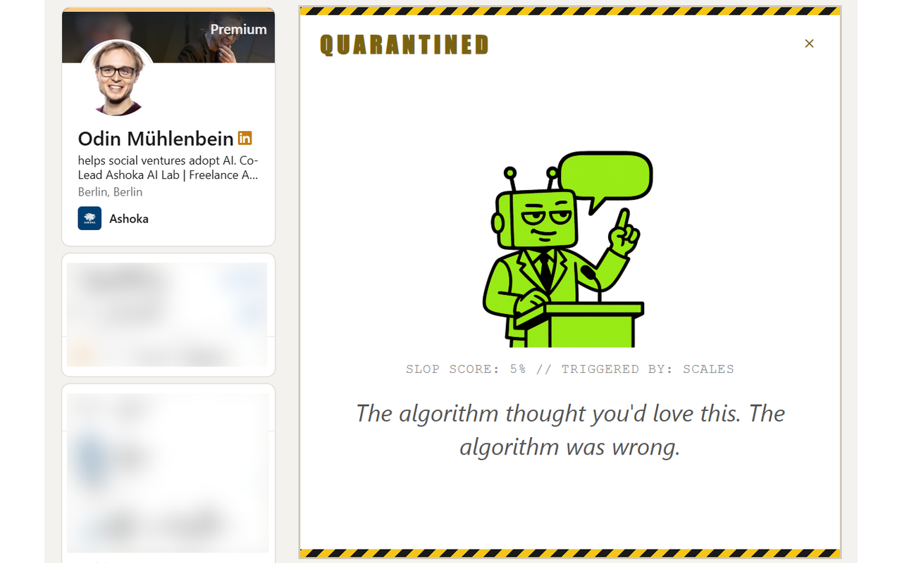
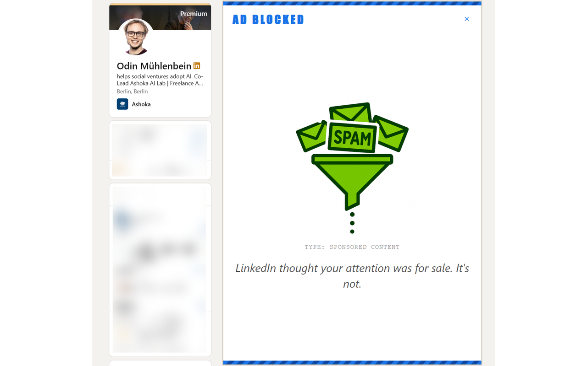

<h1 align="center">LinkedIn Detox</h1>

<p align="center">
  
  &nbsp;
  <i>Your feed deserves better.</i>
  &nbsp;
  
</p>

A free, open-source browser extension that detects AI-generated slop on LinkedIn and either hides it or drops a snarky roast banner right on top. Also blocks promoted/sponsored posts if you're tired of ads pretending to be content. Works on Chrome, Firefox, and Safari.

<p align="center">
  
  &nbsp;&nbsp;
  
</p>

> **Fair warning:** This is satire first, software second. The detection is based on vibes, not science -- pattern matching on buzzwords, sentence templates, and an optional embedding model that's doing its best. It will flag posts that were written by humans and miss posts that were written by machines. Do not accuse anyone of using AI because this extension roasted their post. Do not assume a post is human-written because it wasn't flagged. Treat every roast as comedy, not a verdict.

<p align="center">
  
  
  
  
</p>

## Install

### Chrome

**[Install from the Chrome Web Store](https://chromewebstore.google.com/detail/linkedin-detox/ohfgjbpefhpdkcpmnafcklgmijiageoc)** -- one click and you're done.

Or install manually from source:

1. **Download the code** -- click the green **Code** button at the top of this page, then **Download ZIP**. Unzip it somewhere you'll remember.
2. Open **chrome://extensions/** in your browser
3. Enable **Developer mode** (toggle in the top right)
4. Click **Load unpacked** and select the folder you just unzipped
5. Navigate to [linkedin.com](https://www.linkedin.com) and watch the magic happen

### Firefox and Safari

> **Note (April 2026):** Firefox and Safari builds are code-complete but have not been tested in those browsers yet. They may have rough edges. Bug reports welcome.

**Firefox** -- not yet on AMO. To install manually:
1. Run `npm run build:firefox` (or `npm run build` for all browsers)
2. Open `about:debugging#/runtime/this-firefox`
3. Click **Load Temporary Add-on** and select `dist/linkedin-detox-<version>-firefox.zip`

**Safari** -- requires macOS with Xcode:
1. Run `npm run build:safari` (or `npm run build` for all browsers)
2. Run `xcrun safari-web-extension-converter dist/linkedin-detox-<version>-safari`
3. Open the generated Xcode project, build, and enable the extension in Safari preferences

## Privacy

**Your data never leaves your device.**

All detection happens entirely within your browser. The heuristic scorers run synchronous pattern matching in the content script. The optional semantic scorer runs a quantized MiniLM model in a local offscreen document -- the model is bundled with the extension and performs inference on-device. No text is sent to any API or cloud service.

- **No data collection** -- no analytics, no telemetry, no cookies, no third-party services
- **No network requests** -- all code and model files are bundled locally; the extension never phones home
- **No tracking** -- the extension does not record which posts you view or which posts are flagged
- **Local storage only** -- settings sync via `chrome.storage.sync` (your Google account); session stats stay in `chrome.storage.local`

Full privacy policy available in the extension's Settings > Privacy tab.

## What It Catches

LinkedIn Detox runs every post through a multi-layered detection pipeline:

- **Em dash & ellipsis abuse** -- because real humans -- don't write -- like this...
- **Buzzword density** -- leverage, synergy, unlock, align, disrupt, and the rest of the LinkedIn bingo card
- **Thought-leader templates** -- "I'm humbled to share..." / "Unpopular opinion, but..." (it's never unpopular)
- **AI semantic matching** (opt-in) -- a small embedding model that catches slightly rephrased slop
- **Promoted post blocking** (opt-in) -- detects sponsored posts and blocks them with a distinct blue banner before any slop scoring runs

One strong signal is all it takes. Your feed gets cleaner, one post at a time.

## Settings

Click the extension icon to open the popup:

- **Roast / Hide** -- replace posts with banners, or just make them disappear
- **Sensitivity** -- Chill, Suspicious, or Unhinged (you know which one you want)
- **AI Detection** -- opt-in semantic scoring for catching rephrased slop (model is bundled locally, no downloads)
- **Block Promoted Posts** -- opt-in ad blocker that kills sponsored posts with a blue-themed banner
- **Custom Patterns** -- add your own signal words and co-occurrence patterns for that coworker who keeps posting AI-generated "insights"
- **Test Mode** -- debug overlay that shows scores and triggers on every post

## How It Works

The detection engine scores posts from 0-100 using independent scorers. The final score is `max(all_scores)` -- one strong signal is enough. Posts above your sensitivity threshold get blocked.

The extension watches LinkedIn's feed with a MutationObserver, hashes post text (because LinkedIn virtualizes its DOM and element refs don't persist), and overlays banners on flagged posts every render frame.

For the technically curious, the semantic scorer runs a quantized [MiniLM](https://huggingface.co/Xenova/all-MiniLM-L6-v2) model in a Web Worker, comparing post sentences against ~50 canonical AI-slop phrase types via cosine similarity. It catches the posts that swap "leverage" for "harness" and think they're being original.

## Development

After changing code:

1. Click the refresh icon on the extension card in `chrome://extensions/`
2. Reload the LinkedIn tab

That's it. No bundler, no transpiler, no webpack config longer than the actual code.

### Tests

```bash
npm test
```

Uses vitest. Tests cover the detection engine -- the part that actually matters.

### Building for distribution

```bash
npm run build            # All browsers (Chrome + Firefox + Safari)
npm run build:chrome     # Chrome only
npm run build:firefox    # Firefox only
npm run build:safari     # Safari only
```

Output in `dist/`:
- `linkedin-detox-<version>-chrome.zip` -- upload to the [Chrome Developer Dashboard](https://chrome.google.com/webstore/devconsole)
- `linkedin-detox-<version>-firefox.zip` -- upload to [Firefox Add-ons](https://addons.mozilla.org/)
- `linkedin-detox-<version>-safari/` -- feed to `xcrun safari-web-extension-converter` to create an Xcode project

Each zip/directory contains only the files that browser needs -- no tests, docs, config, or node_modules.

### Updating bundled assets

The repo includes all runtime assets so that cloning or downloading the ZIP gives you a working extension with no extra steps. If you need to regenerate them:

```bash
npm install
```

**Phrase embeddings** -- regenerate after editing the canonical phrases in `scripts/build-embeddings.js`:

```bash
node scripts/build-embeddings.js
```

**Transformers.js library** -- update after bumping the `@xenova/transformers` version in `package.json`:

```bash
cp node_modules/@xenova/transformers/dist/transformers.min.js src/lib/transformers.min.js
```

**MiniLM model files** -- update after changing model version or quantization:

```bash
cp node_modules/@xenova/transformers/.cache/Xenova/all-MiniLM-L6-v2/config.json src/models/Xenova/all-MiniLM-L6-v2/
cp node_modules/@xenova/transformers/.cache/Xenova/all-MiniLM-L6-v2/tokenizer_config.json src/models/Xenova/all-MiniLM-L6-v2/
cp node_modules/@xenova/transformers/.cache/Xenova/all-MiniLM-L6-v2/tokenizer.json src/models/Xenova/all-MiniLM-L6-v2/
cp node_modules/@xenova/transformers/.cache/Xenova/all-MiniLM-L6-v2/onnx/model_quantized.onnx src/models/Xenova/all-MiniLM-L6-v2/onnx/
```

Note: the model files are populated in the npm cache the first time `build-embeddings.js` runs (it triggers a download). If the cache is empty, run `node scripts/build-embeddings.js` first.

## Contributing

See [CONTRIBUTING.md](CONTRIBUTING.md). PRs welcome, especially if you have new roast messages.

## License

[MIT](LICENSE) -- do whatever you want with it. If LinkedIn sends a cease and desist, that just means it's working.
